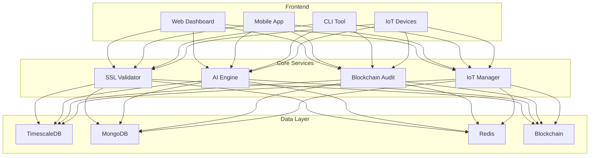
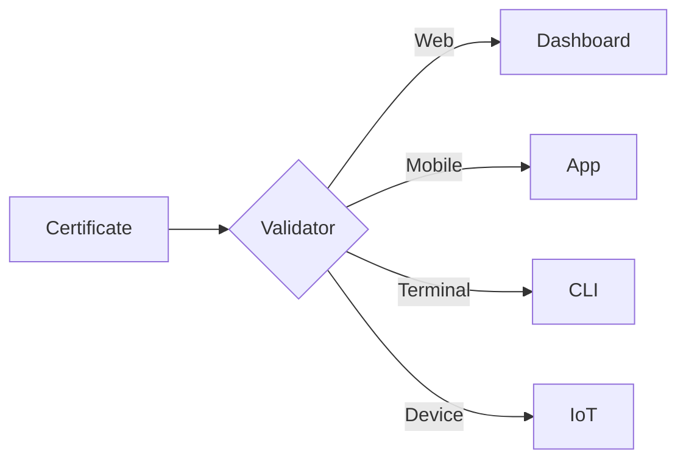
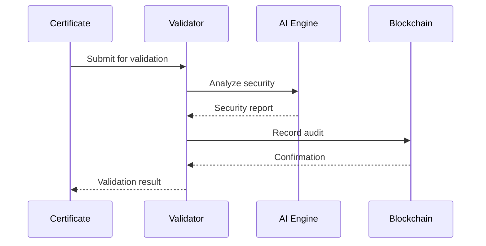
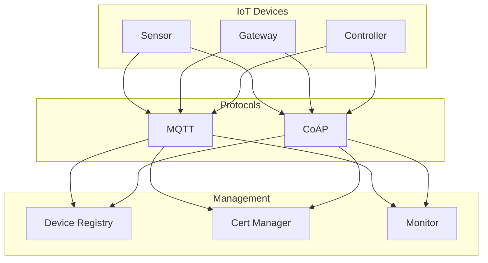
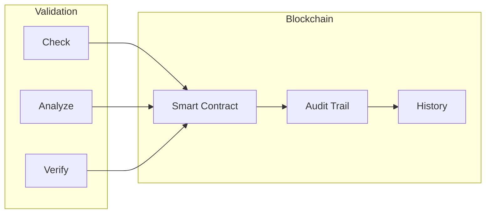

# 🛡️ Universal SSL Validator
> Next-generation SSL certificate management with AI-powered security and eco-conscious features
> 
## 🌟 Vision
Transforming SSL certificate management through AI innovation, blockchain security, and environmental responsibility.

## Architecture Générale


## 🚀 Features
### 🌐 Multi-Platform Support
- **Web Dashboard**: Modern, responsive interface with real-time monitoring
- **Mobile App**: Native iOS and Android apps with biometric security
- **CLI**: Powerful command-line interface for automation
- **IoT Support**: Smart device integration and fleet management



### 🤖 Intelligent Security
- AI-powered vulnerability detection
- ML-based certificate analysis
- Historical pattern detection
- Predictive security alerts
- Voice command security
- Blockchain auditing

### 📉 Data & Analytics
- TimescaleDB for time-series data
- MongoDB for unstructured analysis
- Redis for performance caching
- Real-time ML training
- Blockchain immutable logs



### 📱 Mobile Features
- Biometric security
- Offline support with sync
- Voice commands
- Push notifications
- Native widgets
- QR code scanning

## IoT Integration


## Blockchain Audit


## 🌿 Eco-Conscious Design
- Energy consumption tracking
- Resource optimization
- Carbon footprint monitoring
- Green computing practices

## 🔧 Déploiement & Configuration

### Installation Rapide
```bash
# Clone & Setup
git clone https://github.com/nabz0r/universal-ssl-validator.git
cd universal-ssl-validator

# Démarrer avec Docker
docker-compose -f docker/docker-compose.yml up -d

# Vérifier le statut
./scripts/deploy.sh status
```

### Monitoring
- Dashboards Grafana inclus
- Prometheus pour les métriques
- ELK Stack pour les logs
- Alerting configurable

### Documentation
- [Guide de Déploiement](docs/DEPLOYMENT.md)
- [Configuration](docs/CONFIGURATION.md)
- [API Documentation](docs/API.md)
- [Monitoring](docs/MONITORING.md)
- [Technical Guide](docs/TECHNICAL.md)
- [API Reference](docs/API.md)
- [Database Setup](docs/DATABASE.md)
- [Mobile Guide](docs/MOBILE.md)
- [Widgets Guide](docs/WIDGETS.md)
- [Blockchain Guide](docs/BLOCKCHAIN.md)
- [AI Security](docs/AI_SECURITY.md)
- [IoT Guide](docs/IOT.md)

## Quick Start
```bash
# All operations work offline
ssl-validator check example.com    # Works offline
ssl-validator validate cert.pem    # Local validation
ssl-validator list                # Local cache

# CLI Installation
npm install -g universal-ssl-validator

# Start Databases
docker-compose up -d

# Web Interface
cd ui && npm start

# Mobile App
cd mobile && npm start
```

## 🗺️ Innovation Roadmap
Phase 1: Foundation (Completed ✅)
- [x] Core validation system
- [x] AI security analysis
- [x] Web dashboard
- [x] Mobile app base
- [x] Database & Analytics

Phase 2: Enhancement (Completed ✅)
- [x] Push notifications
- [x] Offline mode
- [x] Native widgets
- [x] Voice commands

Phase 3: Innovation (Completed ✅)
- [x] Blockchain audit system (#17)
- [x] AI predictive security (#18)
- [x] IoT integration (#19)
- [x] Smart contract validation

Phase 4: Future (Planned 🔮)
- [ ] Quantum-safe encryption
- [ ] AR/VR security visualization
- [ ] AI-powered automation
- [ ] Cross-chain integration

## Features Status
### Core System
- ✅ SSL Validation
- ✅ AI Analysis
- ✅ Energy Monitoring
- ✅ Multi-provider Support

### Web Dashboard
- ✅ Real-time Monitoring
- ✅ Analytics Dashboard
- ✅ Certificate Management
- ✅ Advanced Reports

### Mobile App
- ✅ Certificate Scanning
- ✅ Push Notifications
- ✅ Offline Mode
- ✅ Widgets
- ✅ Voice Commands

### Blockchain & AI
- ✅ Smart Contracts
- ✅ Audit Trail
- ✅ Predictive Analysis
- ✅ Anomaly Detection

### IoT Integration
- ✅ Device Management
- ✅ MQTT Support
- ✅ CoAP Support
- ✅ Firmware Updates

### Database & Analytics
- ✅ TimescaleDB Integration
- ✅ MongoDB Analytics
- ✅ Redis Caching
- ✅ ML Dataset

## 🌲 Environmental Impact
Our commitment to sustainable technology:
- Energy-efficient validation
- Optimized resource usage
- Green computing practices
- Environmental metrics

## Contributing
See [CONTRIBUTING.md](CONTRIBUTING.md) for contribution guidelines.

## License
MIT

Copyright (c) 2024 nabz0r (nabz0r@gmail.com)
GitHub: https://github.com/nabz0r
