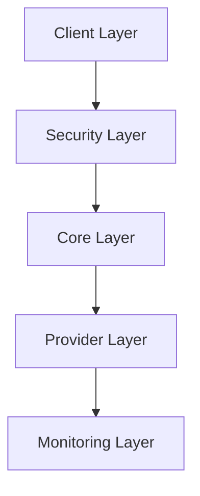

## Phase 1 : Fondations (Complété ✅)
- Système de validation core
- Support multi-providers
- Monitoring énergétique de base

## Phase 2 : Sécurité et Fiabilité (En cours 🚧)
- Audit de sécurité complet (#12)
- Tests exhaustifs (#14)
- Validation robuste des entrées
- Gestion sécurisée des secrets

## Phase 3 : Accessibilité (Planifié 📅)
- Interface CLI intuitive (#13)
- Dashboard web simple
- Documentation interactive
- Tutoriels et guides

## Phase 4 : Évolution (À venir 🔮)
- Support providers additionnels
- Analytics avancés
- Automatisation complète
- Intégrations tierces

## Phase 5 : Enterprise (Future 🎯)
- Support multi-tenant
- High availability
- Reporting personnalisé
- SLA monitoring`
    },
    {
      `path`: `docs/architecture.md`,
      `content`: `# 🏗️ Architecture

## Vue d'ensemble

## Composants

Chaque couche est conçue pour être :
- Indépendante
- Testable
- Sécurisée
- Évolutive`
    }

`nabz0r`,
  `message`: `📚 Documentation mise à jour avec roadmap et architecture`
