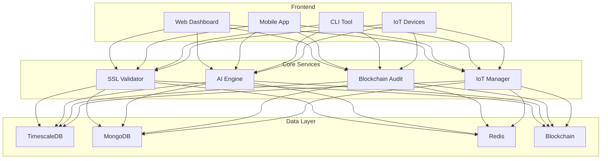
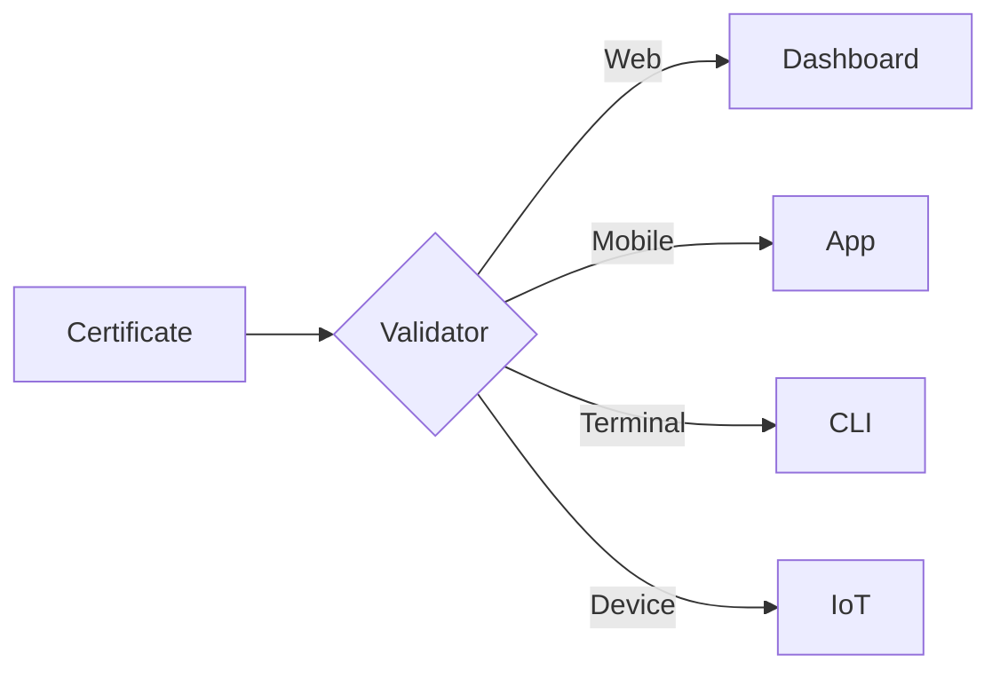
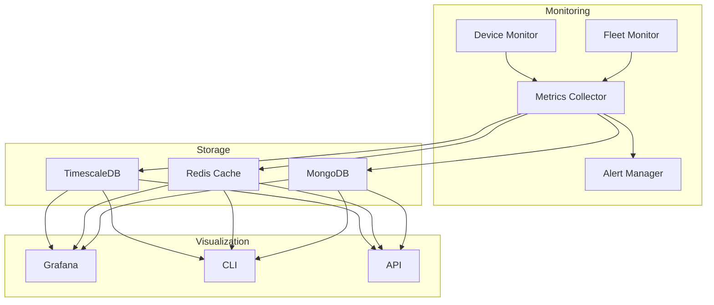
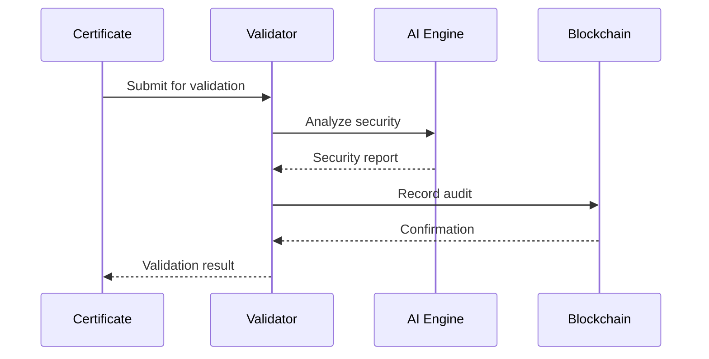

# 🛡️ Universal SSL Validator
> Next-generation SSL certificate management with AI-powered security and eco-conscious features
> 
## 🌟 Vision
Transforming SSL certificate management through AI innovation, blockchain security, and environmental responsibility.

## Architecture Générale

## 🚀 Features

### 🌐 Multi-Platform Support
- **Web Dashboard**: Modern, responsive interface with real-time monitoring
- **Mobile App**: Native iOS and Android apps with biometric security
- **CLI**: Powerful command-line interface for automation
- **IoT Support**: Smart device integration and fleet management

### 🤖 Intelligent Security
- AI-powered vulnerability detection
- ML-based certificate analysis
- Historical pattern detection
- Predictive security alerts
- Voice command security
- Blockchain auditing
- Rate limiting & DDoS protection
- Input validation & sanitization
- Standardized error handling

### 📉 Data & Analytics
- TimescaleDB for time-series data
- MongoDB for unstructured analysis
- Redis for performance caching
- Real-time ML training
- Blockchain immutable logs

### 📊 Monitoring Avancé
- Device Monitoring temps réel
- Fleet Management complet
- Métriques temps réel & historiques
- Détection anomalies automatique
- Alertes configurables
- Rotation certificats intelligente
- Dashboards Grafana intégrés

### 📱 Mobile Features
- Biometric security
- Offline support with sync
- Voice commands
- Push notifications
- Native widgets
- QR code scanning

[GARDER TOUT LE RESTE DU README EXISTANT JUSQU'À LA SECTION Core Components Status]

### Core Components Status

### Core System
- ✅ SSL Validation Engine
- ✅ Certificate Chain Validation
- ✅ OCSP Integration
- ✅ CT Log Verification
- ✅ Rate Limiting
- ✅ Input Validation
- ✅ TLS Hardening
- ✅ Basic Monitoring
- ✅ Error Handling

### Security
- ✅ Rate Limiting
- ✅ Input Sanitization
- ✅ Basic Security Checks
- ✅ Error Standardization
- ⚠️ Advanced Threat Detection
- ✅ Anomaly Detection

### Monitoring & Metrics
- ✅ Basic Logging
- ✅ Security Logs
- ✅ Performance Metrics
- ✅ Device Monitoring
- ✅ Fleet Metrics
- ✅ Alert System
- ✅ Grafana Integration
- ✅ Metric Storage
- ✅ Real-time Updates
- ⚠️ Energy Monitoring
- ⚠️ Advanced Analytics
- ⚠️ AI-Powered Analysis

[GARDER ABSOLUMENT TOUT LE RESTE DU README EXISTANT]