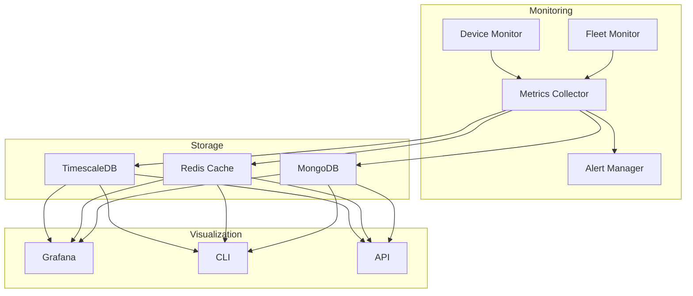

{CONTENU EXISTANT COMPLET}

### 📊 Monitoring Avancé
- Device Monitoring temps réel
- Fleet Management complet
- Métriques temps réel & historiques
- Détection anomalies automatique
- Alertes configurables
- Rotation certificats intelligente
- Dashboards Grafana intégrés

