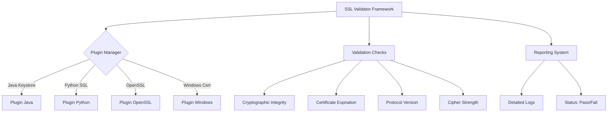

# 🔐 Universal SSL/TLS Validator Framework


## 🌐 Présentation du Projet

Un framework universel de validation SSL/TLS permettant de vérifier la sécurité des certificats à travers différentes plateformes et écosystèmes.

### 🎯 Objectifs Principaux

- Validation cross-plateforme (Java, Python, OpenSSL, Windows)
- Analyse cryptographique approfondie
- Détection des vulnérabilités SSL/TLS
- Reporting unifié et détaillé

## 🏗️ Architecture du Système

<details>
<summary>Architecture Globale</summary>


</details>

## 🚀 Plan de Développement (Beta V0.1)

### Phase 1: Fondations
- [x] Architecture de base
- [ ] Plugin Java Keystore
- [ ] Plugin Python SSL
- [ ] Système de validation core

### Phase 2: Validation
- [ ] Vérification des versions de protocole
- [ ] Analyse des algorithmes de chiffrement
- [ ] Validation des certificats

### Phase 3: Reporting
- [ ] Système de logs détaillés
- [ ] Interface de reporting
- [ ] Intégration des métriques de sécurité

### Phase 4: Extensibilité
- [ ] Mécanisme de plugin dynamique
- [ ] Support multiplateforme
- [ ] Configurations personnalisables

## 🛠️ Installation

```bash
git clone https://github.com/votre-repo/ssl-validator.git
cd ssl-validator
python -m venv venv
source venv/bin/activate
pip install -r requirements.txt
```

## 📦 Dépendances

- Python 3.8+
- cryptography
- pyOpenSSL
- paramiko (optionnel)

## 🤝 Contribution

1. Fork du projet
2. Créez votre branche de feature (`git checkout -b feature/AmazingFeature`)
3. Commitez vos modifications (`git commit -m 'Add some AmazingFeature'`)
4. Poussez (`git push origin feature/AmazingFeature`)
5. Ouvrez une Pull Request

## 📄 Licence

Distribué sous licence MIT. Voir `LICENSE` pour plus d'informations.

## 📞 Contact

Votre Nom - votre-email@example.com

Lien du Projet: [https://github.com/votre-repo/ssl-validator](https://github.com/votre-repo/ssl-validator)
