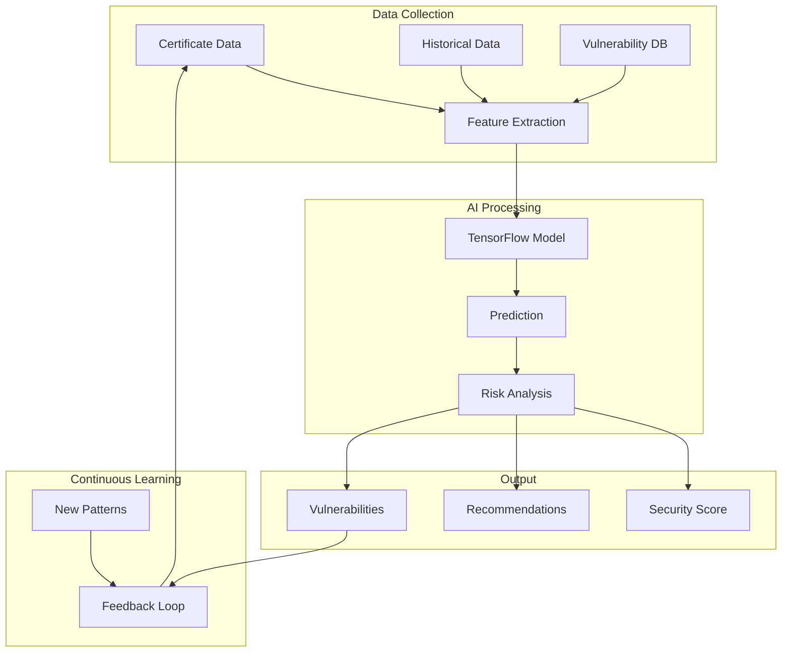
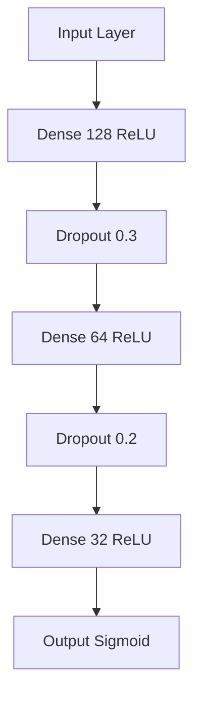

# AI Security Analysis

## System Overview

## Features

### Machine Learning
- TensorFlow.js model
- Continuous training
- Pattern recognition
- Anomaly detection

### Security Analysis
- Algorithm scoring
- Key strength evaluation
- Chain validation
- Trust assessment

### Vulnerability Detection
- Known patterns
- Emerging threats
- Configuration issues
- Best practices

## Model Architecture
