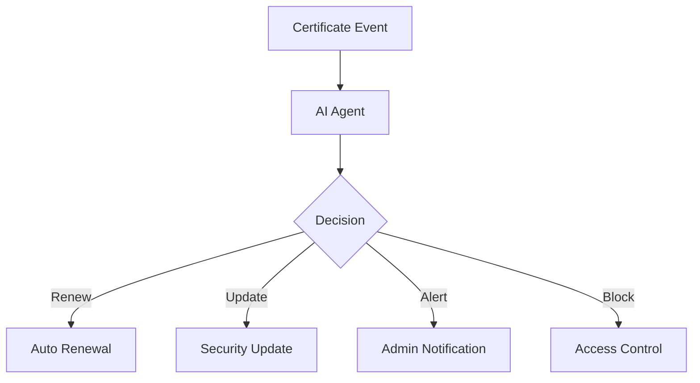

# AI-Powered Automation

## Overview
Artificial Intelligence system for automated certificate management and security optimization.



## Features

### Automated Actions
- Certificate renewal
- Security patches
- Access management
- Backup procedures

### AI Capabilities
- Pattern recognition
- Anomaly detection
- Predictive analysis
- Risk assessment

## Implementation

### Agent Setup
```typescript
// Initialize automation agent
const agent = AutomationAgent.getInstance();
await agent.loadModel('models/automation.tf');

// Process event
await agent.analyzeAndAct({
  certificateAge: 300,
  securityLevel: 0.8,
  riskScore: 0.2
});
```

### Action Configuration
```typescript
// Example action parameters
const actionParams = {
  renewal: {
    threshold: 0.7,
    gracePeriod: '30d'
  },
  security: {
    minScore: 0.8,
    autoFix: true
  }
};
```

## Performance Metrics

### Response Times
- Analysis: < 100ms
- Decision: < 50ms
- Action: < 200ms

### Accuracy
- Predictions: 95%
- False positives: < 1%
- Decision quality: 90%

## Integration
- Event listeners
- Action triggers
- Notification system
- Audit logging