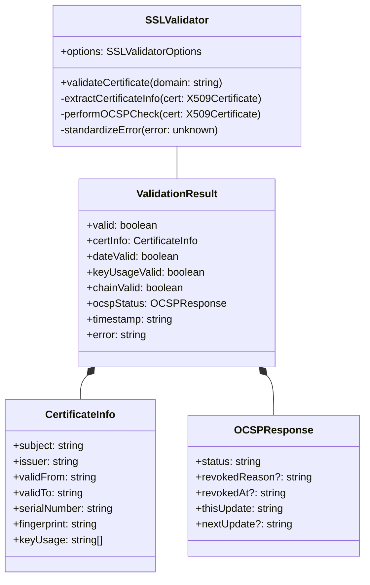

# API Reference

## Core API



## Usage Examples

```typescript
// Basic usage
const validator = new SSLValidator();
const result = await validator.validateCertificate('example.com');

// Advanced configuration
const validator = new SSLValidator({
    checkOCSP: true,
    timeout: 5000,
    maxRetries: 3,
    cache: true,
    cacheExpiry: 3600,
    securityLevel: 'high',
    monitoring: true
});

// Error handling
try {
    const result = await validator.validateCertificate('example.com');
    if (!result.valid) {
        console.error(`Validation failed: ${result.error}`);
        // Handle specific validation failures
        if (!result.dateValid) {
            console.error('Certificate expired or not yet valid');
        }
        if (!result.chainValid) {
            console.error('Invalid certificate chain');
        }
        if (result.ocspStatus?.status === 'revoked') {
            console.error('Certificate has been revoked');
        }
    }
} catch (error) {
    console.error('Validation error:', error);
}
```

## Configuration Options

```typescript
interface SSLValidatorOptions {
    // Basic options
    checkOCSP: boolean;      // Enable OCSP verification
    timeout: number;         // Request timeout in ms
    maxRetries: number;      // Max retry attempts
    cache: boolean;          // Enable result caching
    cacheExpiry: number;     // Cache TTL in seconds

    // Advanced options
    minKeySize?: number;     // Minimum key size in bits
    allowedAlgorithms?: string[];  // Allowed signature algorithms
    requiredKeyUsage?: string[];   // Required key usage flags
    securityLevel?: 'basic' | 'standard' | 'high';
    monitoring?: boolean;    // Enable performance monitoring
}
```

## Response Types

### ValidationResult
```typescript
interface ValidationResult {
    valid: boolean;          // Overall validation result
    certInfo: CertificateInfo | null;  // Certificate details
    dateValid: boolean;      // Date validation result
    keyUsageValid: boolean;  // Key usage validation
    chainValid: boolean;     // Chain validation result
    ocspStatus: OCSPResponse | null;  // OCSP check result
    timestamp: string;       // Validation timestamp
    error: string | null;    // Error message if any
}
```

### Error Codes

The validator returns standardized error codes:

- `INVALID_INPUT`: Invalid domain format
- `NETWORK_ERROR`: Network connectivity issues
- `CERT_ERROR`: Certificate parsing errors
- `TIMEOUT_ERROR`: Request timeout
- `OCSP_ERROR`: OCSP verification failed
- `INTERNAL_ERROR`: Internal system errors
- `UNKNOWN_ERROR`: Unclassified errors

## Advanced Features

### Cache Management
Results are cached based on domain name when caching is enabled:

```typescript
// Enable caching with custom TTL
const validator = new SSLValidator({
    cache: true,
    cacheExpiry: 7200  // 2 hours
});
```

### Security Levels

Predefined security levels configure multiple settings:

- `basic`: Minimal validation
- `standard`: Industry standard checks
- `high`: Enhanced security requirements

```typescript
const validator = new SSLValidator({
    securityLevel: 'high'
});
```
