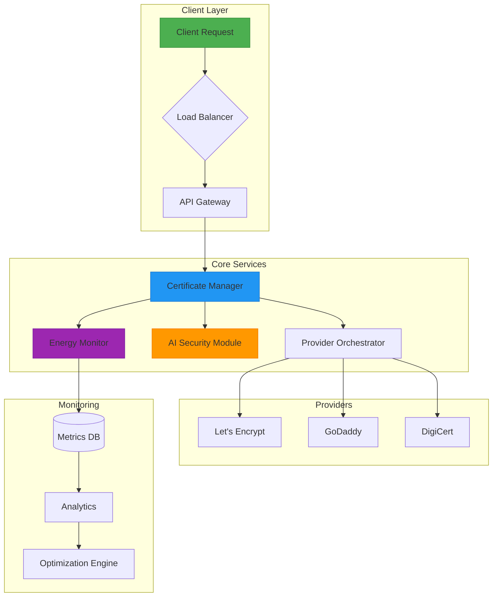
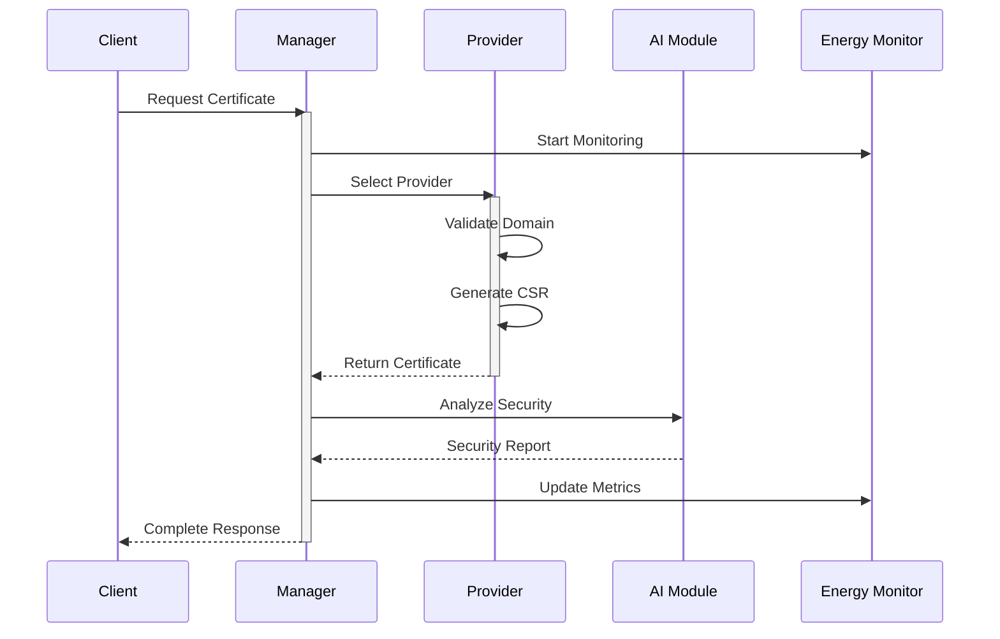
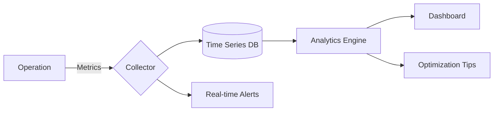

# 🏗️ System Architecture

## System Overview

```mermaid
graph TD
    subgraph Client Layer
        A[Client Request] --> B{Load Balancer}
        B --> C[API Gateway]
    end

    subgraph Core Services
        C --> D[Certificate Manager]
        D --> E[Provider Orchestrator]
        D --> F[AI Security Module]
        D --> G[Energy Monitor]
    end

    subgraph Providers
        E --> H[Let's Encrypt]
        E --> I[GoDaddy]
        E --> J[DigiCert]
    end

    subgraph Monitoring
        G --> K[(Metrics DB)]
        K --> L[Analytics]
        L --> M[Optimization Engine]
    end

    style A fill:#4CAF50,stroke:#388E3C
    style D fill:#2196F3,stroke:#1976D2
    style F fill:#FF9800,stroke:#F57C00
    style G fill:#9C27B0,stroke:#7B1FA2
```

## Certificate Validation Flow

```mermaid
sequenceDiagram
    participant C as Client
    participant M as Manager
    participant P as Provider
    participant AI as AI Module
    participant E as Energy Monitor

    C->>M: Request Certificate
    activate M
    M->>E: Start Monitoring
    M->>P: Select Provider
    activate P
    P->>P: Validate Domain
    P->>P: Generate CSR
    P-->>M: Return Certificate
    deactivate P
    M->>AI: Analyze Security
    AI-->>M: Security Report
    M->>E: Update Metrics
    M-->>C: Complete Response
    deactivate M
```

## Monitoring System

```mermaid
graph LR
    A[Operation] -->|Metrics| B{Collector}
    B --> C[(Time Series DB)]
    B --> D[Real-time Alerts]
    C --> E[Analytics Engine]
    E --> F[Dashboard]
    E --> G[Optimization Tips]
```
