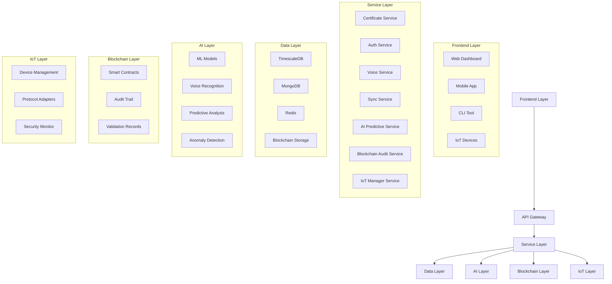

# Architecture du Système

## Vue d'Ensemble

## Composants

### Frontend Layer
- Dashboard web React
- Application mobile React Native
- Interface CLI
- Intégration IoT

### Service Layer
- API REST
- WebSocket temps réel
- Traitement vocal
- IA prédictive
- Audit blockchain
- Gestion IoT

### Data Layer
- Métriques temporelles
- Stockage documents
- Cache
- Stockage blockchain

### AI Layer
- Reconnaissance vocale
- Analyse prédictive
- Détection d'anomalies
- Apprentissage continu

### Blockchain Layer
- Gestion des smart contracts
- Audit trail immuable
- Validation des certificats

### IoT Layer
- Gestion des appareils
- Adaptateurs de protocoles
- Sécurité et surveillance

## Communication

### Interne
- gRPC pour les services
- Redis pub/sub
- Streaming d'événements
- MQTT pour IoT

### Externe
- API REST
- WebSocket
- Flux vocaux
- Blockchain RPC

## Sécurité

### Authentification
- Tokens JWT
- Auth biométrique
- Reconnaissance vocale
- Clés blockchain

### Protection des Données
- Chiffrement de bout en bout
- Chiffrement au repos
- Sécurité des données vocales
- Protection IoT