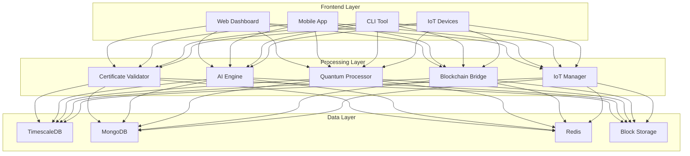
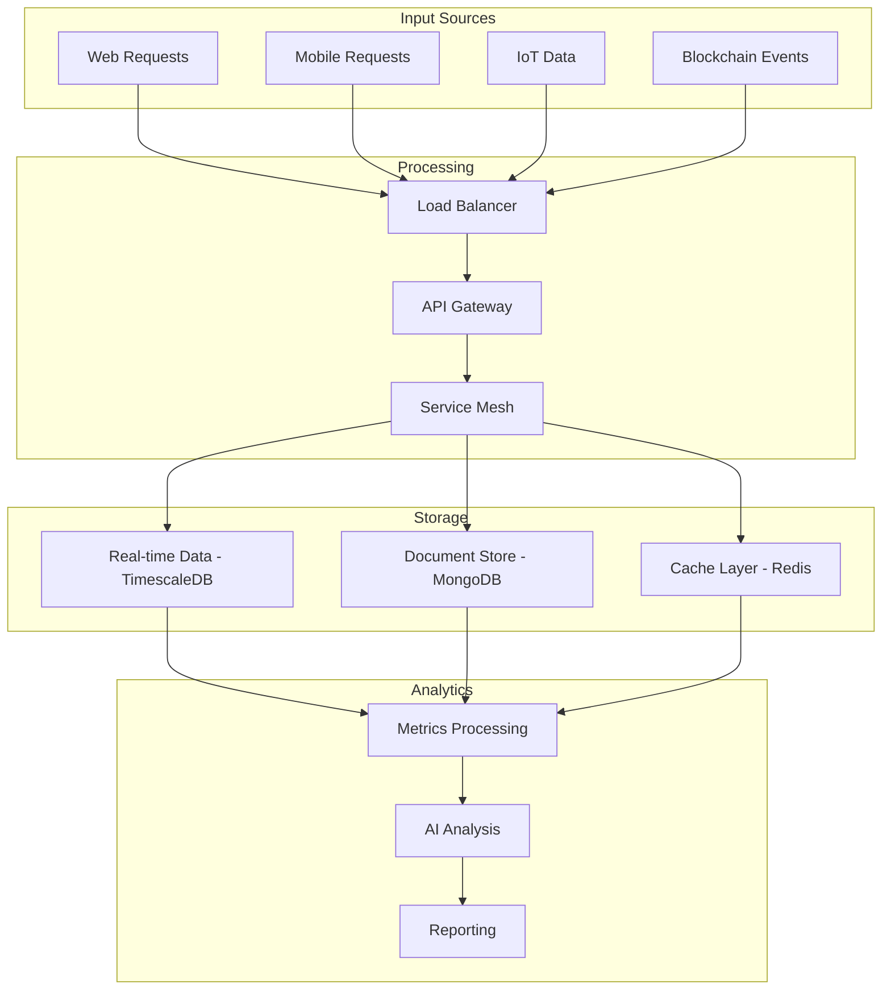
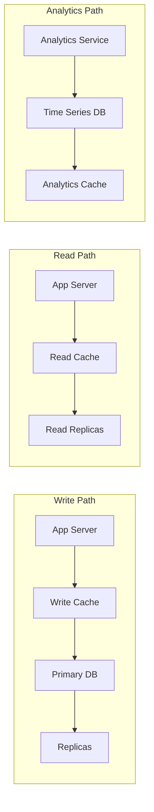
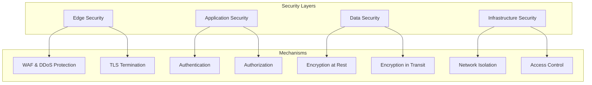
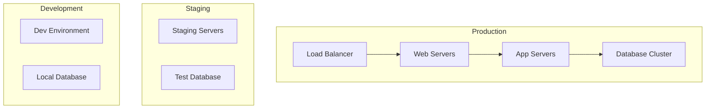
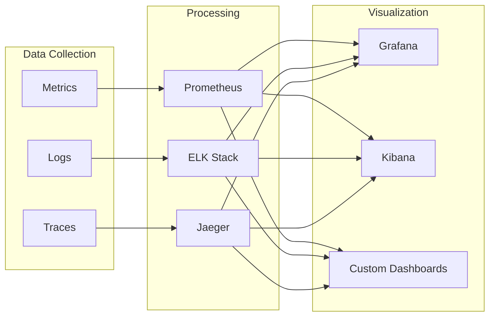
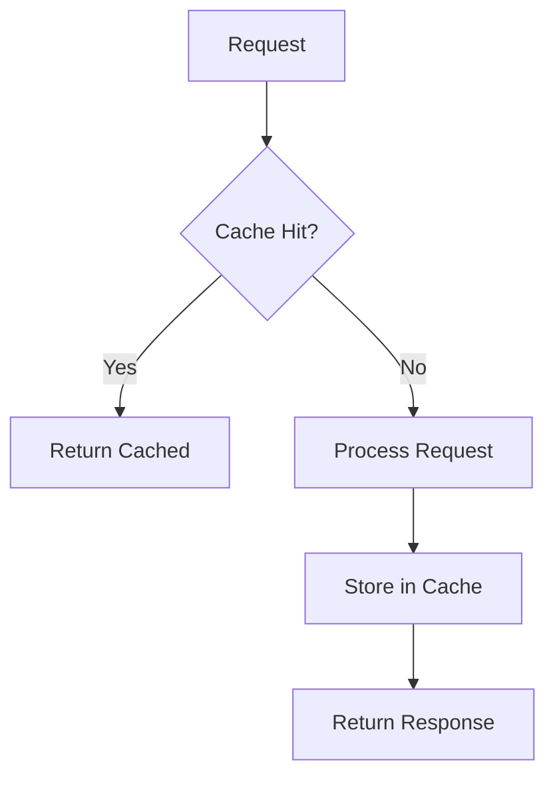

# System Architecture

## Overall Architecture

## Data Flow Architecture

## Database Architecture

## Service Integration

### Core Services
- Certificate validation service
- AI/ML analysis service
- IoT device management
- Blockchain audit service
- Quantum encryption service

### Support Services
- Authentication service
- Metrics collection
- Logging service
- Alert management
- Cache management

## Security Architecture

## Deployment Architecture

## Monitoring & Observability

## Cache Strategy

## Infrastructure Components

### Application Servers
- Node.js instances
- Load balanced
- Auto-scaled

### Databases
- TimescaleDB cluster
- MongoDB replica set
- Redis cluster

### Cache Layer
- Redis primary-replica
- Multiple shards
- Persistence enabled

### Message Queue
- RabbitMQ cluster
- Multiple vhosts
- High availability

## Scalability Considerations

### Horizontal Scaling
- Database sharding
- Service replication
- Load distribution

### Vertical Scaling
- Resource optimization
- Performance tuning
- Capacity planning

## Backup Strategy

### Database Backups
- Continuous replication
- Point-in-time recovery
- Geo-replication

### Application Backups
- Configuration backups
- Code versioning
- State management

## Disaster Recovery

### High Availability
- Multi-zone deployment
- Automatic failover
- Service redundancy

### Recovery Procedures
- Automated recovery
- Manual intervention
- Data consistency checks