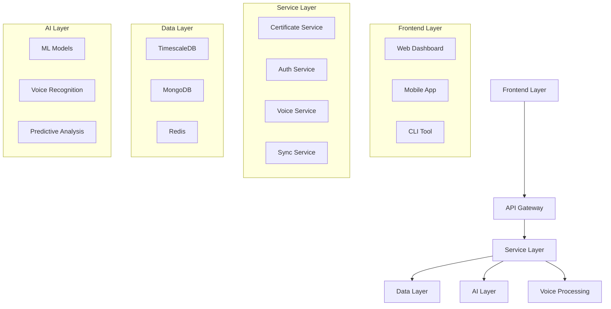

# System Architecture

## Overview

## Components

### Frontend Layer
- React-based web dashboard
- React Native mobile app
- Voice-enabled CLI tool

### Service Layer
- RESTful API services
- WebSocket real-time updates
- Voice command processing

### Data Layer
- Time-series metrics
- Document storage
- Cache layer

### Voice Processing Layer
- Command recognition
- Natural language processing
- State management
- Feedback system

## Communication

### Internal
- gRPC for services
- Redis pub/sub
- Event streaming

### External
- REST APIs
- WebSocket
- Voice streams

## Security

### Authentication
- JWT tokens
- Biometric auth
- Voice recognition

### Data Protection
- End-to-end encryption
- At-rest encryption
- Voice data security