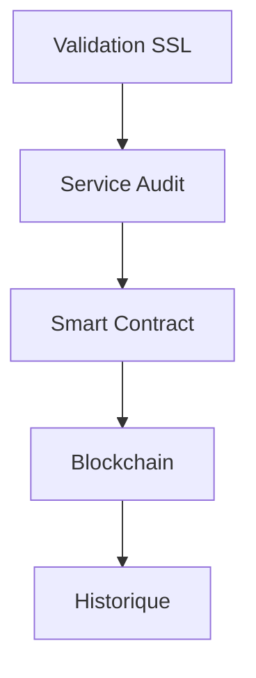

# Système d'Audit Blockchain

## Vue d'ensemble
Le système d'audit blockchain fournit une traçabilité immuable des validations de certificats SSL.

## Fonctionnalités
- Enregistrement des audits sur la blockchain
- Historique immuable des validations
- Vérification des certificats
- Smart contracts pour l'automatisation

## Architecture


## Smart Contract
- Stockage des audits
- Vérification des événements
- Gestion des accès
- Traçabilité complète

## API Blockchain
```typescript
// Exemple d'utilisation
const audit = new BlockchainAuditService();

// Enregistrer un audit
await audit.recordAudit({
  domain: 'example.com',
  certificateHash: '0x...',
  timestamp: Date.now(),
  validationResult: true,
  auditor: '0x...'
});

// Vérifier l'historique
const history = await audit.getAuditHistory('example.com');
```

## Sécurité
- Validation multi-signatures
- Protection contre la falsification
- Historique immuable
- Accès contrôlé

## Configuration
```env
BLOCKCHAIN_RPC_URL=https://...
CONTRACT_ADDRESS=0x...
AUDITOR_KEY=...
```