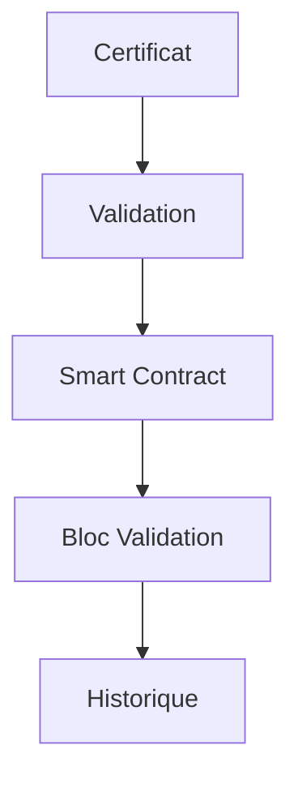

# Système d'Audit Blockchain

## Architecture

### Smart Contracts
- Validation des signatures
- Gestion des autorités
- Stockage des certificats
- Historique des validations

### Chainage


## APIs

### REST
```typescript
GET /blockchain/audit/{domain}
POST /blockchain/record
```

### Events
```solidity
event CertificateValidated(
    string domain,
    bool valid,
    uint256 timestamp
);
```

## Configuration
```yaml
blockchain:
  network: "mainnet"
  contract: "0x..."
  autoCommit: true
  gasLimit: 200000
```