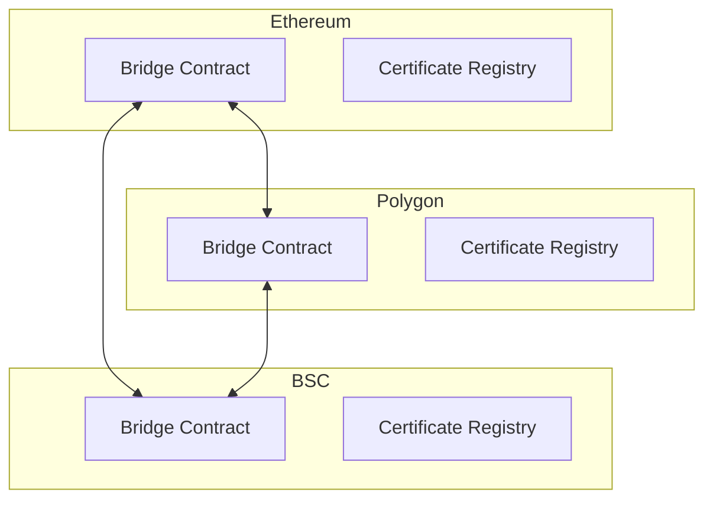

# Cross-Chain Integration

## Architecture



## Features

### Bridge Operations
- Cross-chain certificate validation
- Multi-chain synchronization
- Atomic transfers
- Validator consensus

### Security
- Multi-signature validation
- Threshold signatures
- Fraud proofs
- Replay protection

## Implementation

### Bridge Setup
```typescript
// Example usage
const bridge = new CrossChainBridge();

// Add chain support
await bridge.addChain({
  name: 'ethereum',
  rpcUrl: 'https://ethereum-rpc.com',
  chainId: 1,
  contractAddress: '0x...',
  bridgeAddress: '0x...'
});
```

### Certificate Transfer
```typescript
// Initiate cross-chain transfer
const txHash = await bridge.initiateTransfer(
  'ethereum',
  'polygon',
  certificateData
);

// Check status
const status = await bridge.checkTransferStatus(txHash, 'polygon');
```

## Configuration

### Network Settings
```env
ETHEREUM_RPC=https://ethereum-rpc.com
POLYGON_RPC=https://polygon-rpc.com
BSC_RPC=https://bsc-rpc.com

BRIDGE_CONTRACT_ETH=0x...
BRIDGE_CONTRACT_POLYGON=0x...
BRIDGE_CONTRACT_BSC=0x...
```

## Monitoring
- Cross-chain transaction status
- Validator health
- Network latency
- Gas consumption