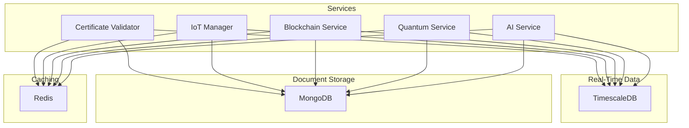
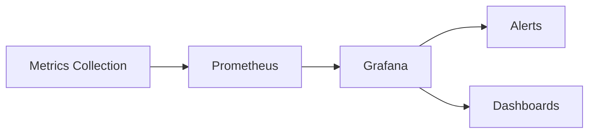

# Database Architecture

## Overview



## Database Roles

### TimescaleDB
- Time-series metrics storage
- Performance monitoring
- Real-time analytics
- Historical data analysis

### MongoDB
- Certificate data storage
- IoT device configurations
- Blockchain transactions
- AI training data
- Quantum certificates

### Redis
- Real-time caching
- Session management
- Temporary data storage
- Rate limiting

## Schema Structure

### TimescaleDB Tables
```sql
-- Certificate Metrics
CREATE TABLE certificate_metrics (
    id BIGSERIAL PRIMARY KEY,
    certificate_id VARCHAR(255) NOT NULL,
    validation_time FLOAT NOT NULL,
    response_time FLOAT NOT NULL,
    security_score FLOAT NOT NULL,
    timestamp TIMESTAMPTZ NOT NULL
);

-- IoT Device Metrics
CREATE TABLE device_metrics (
    id BIGSERIAL PRIMARY KEY,
    device_id VARCHAR(255) NOT NULL,
    cpu_usage FLOAT,
    memory_usage FLOAT,
    network_latency FLOAT,
    certificate_status VARCHAR(50),
    timestamp TIMESTAMPTZ NOT NULL
);

-- Blockchain Metrics
CREATE TABLE blockchain_metrics (
    id BIGSERIAL PRIMARY KEY,
    transaction_hash VARCHAR(255),
    chain_id INTEGER,
    gas_used BIGINT,
    confirmation_time FLOAT,
    status VARCHAR(50),
    timestamp TIMESTAMPTZ NOT NULL
);

-- Quantum Metrics
CREATE TABLE quantum_metrics (
    id BIGSERIAL PRIMARY KEY,
    certificate_id VARCHAR(255),
    key_size INTEGER,
    encryption_time FLOAT,
    decryption_time FLOAT,
    algorithm VARCHAR(50),
    timestamp TIMESTAMPTZ NOT NULL
);
```

### MongoDB Collections

```javascript
// Certificates
db.certificates.createIndex({ id: 1 }, { unique: true })
db.certificates.createIndex({ domain: 1 })
db.certificates.createIndex({ expiryDate: 1 })

// IoT Devices
db.devices.createIndex({ deviceId: 1 }, { unique: true })
db.devices.createIndex({ status: 1 })

// Blockchain Transactions
db.transactions.createIndex({ hash: 1 }, { unique: true })
db.transactions.createIndex({ chainId: 1 })

// Quantum Certificates
db.quantum_certificates.createIndex({ id: 1 }, { unique: true })
db.quantum_certificates.createIndex({ algorithm: 1 })
```

### Redis Keys Structure

```
# Certificates
cert:{id} -> Certificate data
cert:validation:{id} -> Validation result

# IoT Devices
device:{id}:status -> Device status
device:{id}:metrics -> Recent metrics

# Blockchain
tx:{hash} -> Transaction status
chain:{id}:metrics -> Chain performance metrics

# Quantum
quantum_cert:{id} -> Quantum certificate data
quantum:keys:{id} -> Encryption keys
```

## Performance Considerations

### TimescaleDB
- Automated data retention policies
- Chunk time intervals: 1 day for metrics
- Compression enabled for data older than 7 days
- Continuous aggregates for common queries

### MongoDB
- Sharding strategy for large collections
- Compound indexes for common queries
- Document validation rules
- TTL indexes for temporary data

### Redis
- Key expiration policies
- Memory limits per key type
- Eviction policies: volatile-lru
- Persistence configuration

## Integration Examples

### Certificate Validation
```typescript
// Store validation result
await timescaleDb.storeCertificateMetrics({
  certificateId: cert.id,
  validationTime,
  responseTime,
  securityScore
});

// Cache result
await redisCache.setValidationResult(
  cert.id,
  result,
  3600
);
```

### IoT Metrics
```typescript
// Store device metrics
await timescaleDb.query(`
  INSERT INTO device_metrics (
    device_id, cpu_usage, memory_usage
  ) VALUES ($1, $2, $3)
`, [deviceId, cpuUsage, memoryUsage]);

// Update device status
await mongoDb.devices.updateOne(
  { _id: deviceId },
  { $set: { status, lastUpdate: new Date() }}
);
```

## Backup Strategy

### TimescaleDB
- Continuous archiving (WAL)
- Daily full backups
- Point-in-time recovery enabled

### MongoDB
- Replica sets with 3 nodes
- Oplog backup every 6 hours
- Daily mongodump for cold storage

### Redis
- AOF persistence enabled
- RDB snapshots every hour
- Replica for immediate recovery

## Monitoring



### Key Metrics
- Query performance
- Cache hit rates
- Storage usage
- Connection pools
- Replication lag
- Index efficiency