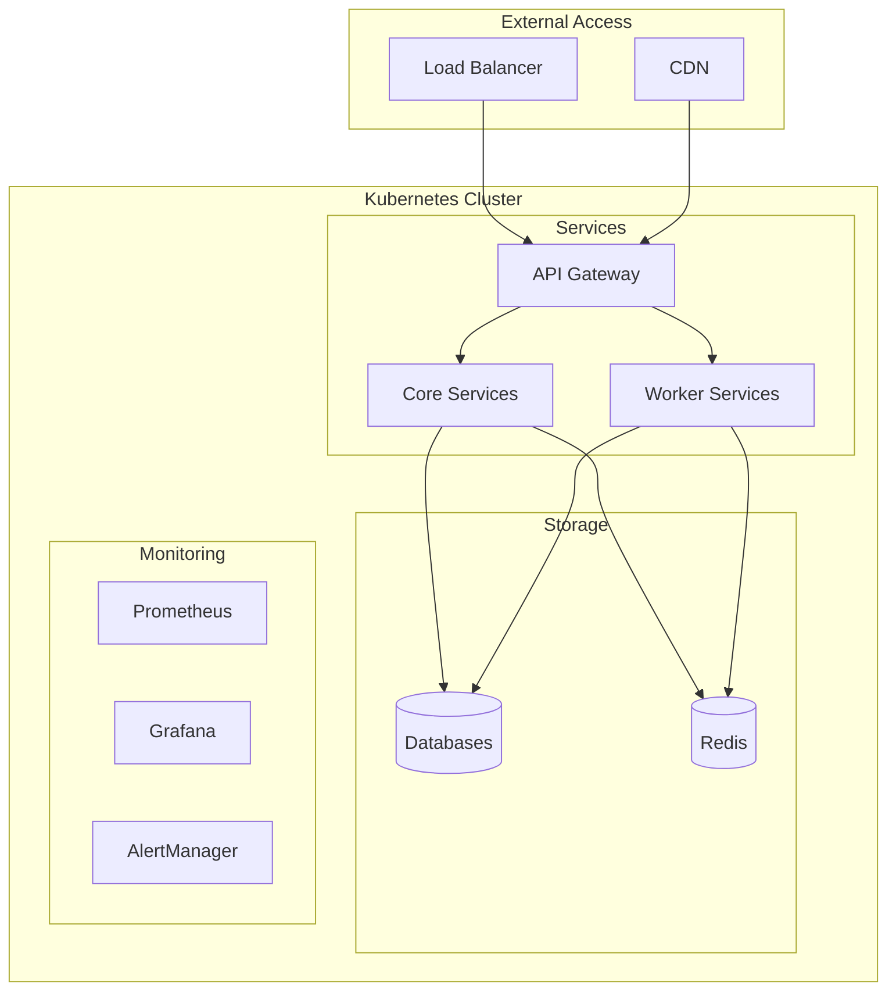

# Guide de Déploiement Complet

## Table des Matières
- [Prérequis](#prérequis)
- [Architecture de Déploiement](#architecture-de-déploiement)
- [Configuration de l'Infrastructure](#configuration-de-linfrastructure)
- [Installation](#installation)
- [Configuration des Bases de Données](#configuration-des-bases-de-données)
- [Déploiement des Services](#déploiement-des-services)
- [Configuration du Monitoring](#configuration-du-monitoring)
- [Sécurité](#sécurité)
- [Maintenance](#maintenance)

## Prérequis

### Infrastructure Minimale
```yaml
Production:
  Application Servers:
    CPU: 8 cores
    RAM: 32GB
    Storage: 100GB SSD
    Count: 3+

  Database Servers:
    TimescaleDB:
      CPU: 16 cores
      RAM: 64GB
      Storage: 500GB NVMe
      Count: 3 (1 primary, 2 replicas)

    MongoDB:
      CPU: 16 cores
      RAM: 64GB
      Storage: 1TB NVMe
      Count: 3 (replica set)

    Redis:
      CPU: 8 cores
      RAM: 32GB
      Storage: 100GB SSD
      Count: 3 (cluster)

Staging:
  Application Servers:
    CPU: 4 cores
    RAM: 16GB
    Count: 2

  Database Servers:
    Consolidated DB Server:
      CPU: 8 cores
      RAM: 32GB
      Storage: 500GB SSD
```

### Logiciels Requis
```bash
# Versions requises
Docker: 24.0.0+
Kubernetes: 1.27+
Helm: 3.12+
Node.js: 18.0.0+
PostgreSQL: 15+ (avec TimescaleDB 2.11+)
MongoDB: 6.0+
Redis: 7.0+
```

## Architecture de Déploiement



## Configuration de l'Infrastructure

### Terraform pour AWS
```hcl
module "eks" {
  source = "terraform-aws-modules/eks/aws"
  version = "19.15.1"

  cluster_name = "ssl-validator-cluster"
  cluster_version = "1.27"

  vpc_id     = module.vpc.vpc_id
  subnet_ids = module.vpc.private_subnets

  cluster_endpoint_public_access = true

  eks_managed_node_groups = {
    general = {
      desired_size = 3
      min_size    = 3
      max_size    = 5

      instance_types = ["t3.xlarge"]
      capacity_type  = "ON_DEMAND"
    }

    database = {
      desired_size = 3
      min_size    = 3
      max_size    = 3

      instance_types = ["r6i.2xlarge"]
      capacity_type  = "ON_DEMAND"

      taints = [{
        key    = "workload"
        value  = "database"
        effect = "NO_SCHEDULE"
      }]
    }
  }
}
```

## Installation

### Configuration Initiale
```bash
# Clone du dépôt
git clone https://github.com/nabz0r/universal-ssl-validator.git
cd universal-ssl-validator

# Installation des dépendances
npm install

# Configuration de l'environnement
cp .env.example .env
vim .env  # Éditer les variables d'environnement
```

### Déploiement avec Helm
```bash
# Ajout des repos Helm
helm repo add bitnami https://charts.bitnami.com/bitnami
helm repo add timescale https://charts.timescale.com
helm repo update

# Installation des dépendances
helm install ssl-validator-redis bitnami/redis -f helm/redis-values.yaml
helm install ssl-validator-timescaledb timescale/timescaledb-single -f helm/timescaledb-values.yaml
helm install ssl-validator-mongodb bitnami/mongodb -f helm/mongodb-values.yaml

# Installation de l'application
helm install ssl-validator ./helm/ssl-validator -f helm/values-production.yaml
```

## Configuration des Bases de Données

### TimescaleDB
```sql
-- Initialisation de la base
\i scripts/db/init-timescaledb.sql

-- Configuration des rétentions
SELECT add_retention_policy('metrics', INTERVAL '90 days');
SELECT add_retention_policy('logs', INTERVAL '30 days');
```

### MongoDB
```javascript
// Configuration du replica set
rs.initiate({
  _id: "ssl-validator",
  members: [
    { _id: 0, host: "mongodb-0.mongodb:27017" },
    { _id: 1, host: "mongodb-1.mongodb:27017" },
    { _id: 2, host: "mongodb-2.mongodb:27017" }
  ]
});

// Création des collections et indexes
load("scripts/db/init-mongodb.js");
```

### Redis
```bash
# Configuration du cluster Redis
redis-cli --cluster create \
  redis-0.redis:6379 \
  redis-1.redis:6379 \
  redis-2.redis:6379 \
  --cluster-replicas 1

# Application des politiques de cache
redis-cli -h redis-0.redis config set maxmemory-policy allkeys-lru
```

## Déploiement des Services

### Services Core
```yaml
# Deployment des services principaux
apiVersion: apps/v1
kind: Deployment
metadata:
  name: ssl-validator
spec:
  replicas: 3
  strategy:
    type: RollingUpdate
    rollingUpdate:
      maxSurge: 1
      maxUnavailable: 0
  template:
    spec:
      containers:
      - name: ssl-validator
        image: ssl-validator:latest
        resources:
          requests:
            cpu: 1000m
            memory: 2Gi
          limits:
            cpu: 2000m
            memory: 4Gi
        livenessProbe:
          httpGet:
            path: /healthz
            port: 8080
        readinessProbe:
          httpGet:
            path: /ready
            port: 8080
```

## Configuration du Monitoring

### Prometheus
```yaml
global:
  scrape_interval: 15s
  evaluation_interval: 15s

scrape_configs:
  - job_name: 'ssl-validator'
    kubernetes_sd_configs:
      - role: pod
    relabel_configs:
      - source_labels: [__meta_kubernetes_pod_label_app]
        regex: ssl-validator
        action: keep
```

### Grafana Dashboards
```bash
# Import des dashboards
kubectl apply -f monitoring/dashboards/

# Configuration des alertes
kubectl apply -f monitoring/alerts/
```

## Sécurité

### Configuration TLS
```bash
# Génération des certificats
openssl req -x509 -nodes -days 365 -newkey rsa:2048 \
  -keyout ssl-validator.key -out ssl-validator.crt

# Application des certificats
kubectl create secret tls ssl-validator-tls \
  --key ssl-validator.key \
  --cert ssl-validator.crt
```

### Network Policies
```yaml
apiVersion: networking.k8s.io/v1
kind: NetworkPolicy
metadata:
  name: ssl-validator-policy
spec:
  podSelector:
    matchLabels:
      app: ssl-validator
  policyTypes:
  - Ingress
  - Egress
  ingress:
  - from:
    - podSelector:
        matchLabels:
          app: nginx-ingress
  egress:
  - to:
    - podSelector:
        matchLabels:
          app: redis
    - podSelector:
        matchLabels:
          app: mongodb
    - podSelector:
        matchLabels:
          app: timescaledb
```

## Maintenance

### Backup
```bash
# Backup TimescaleDB
pg_dump -Fc ssl_validator > backup/timescaledb_$(date +%Y%m%d).dump

# Backup MongoDB
mongodump --uri="mongodb://mongodb:27017" --out backup/mongodb_$(date +%Y%m%d)

# Backup Redis
redis-cli SAVE
```

### Mise à Jour
```bash
# Mise à jour des charts Helm
helm dependency update ./helm/ssl-validator
helm upgrade ssl-validator ./helm/ssl-validator -f helm/values-production.yaml

# Rolling update des pods
kubectl rollout restart deployment ssl-validator
```

### Monitoring des Performances
```bash
# Vérification des métriques
kubectl top pods -l app=ssl-validator

# Logs des services
kubectl logs -l app=ssl-validator --tail=100 -f

# Statut des bases de données
kubectl exec -it timescaledb-0 -- psql -U postgres -c "SELECT * FROM pg_stat_activity;"
```