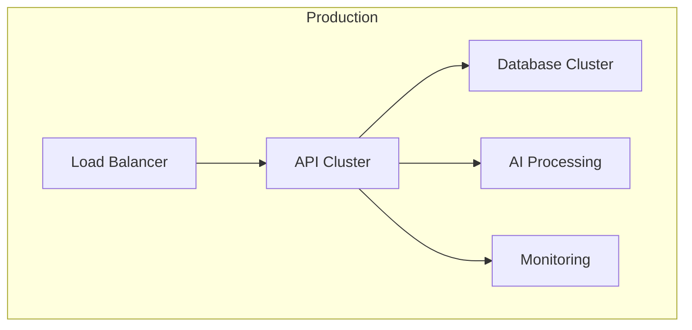

# Guide de Déploiement

## Architecture

## Prérequis
- Docker & Docker Compose
- Node.js 18+
- 8GB RAM minimum
- 4 CPU cores minimum

## Installation
[Guide d'installation détaillé]

## Configuration
[Configuration détaillée]

## Monitoring
[Guide de monitoring]