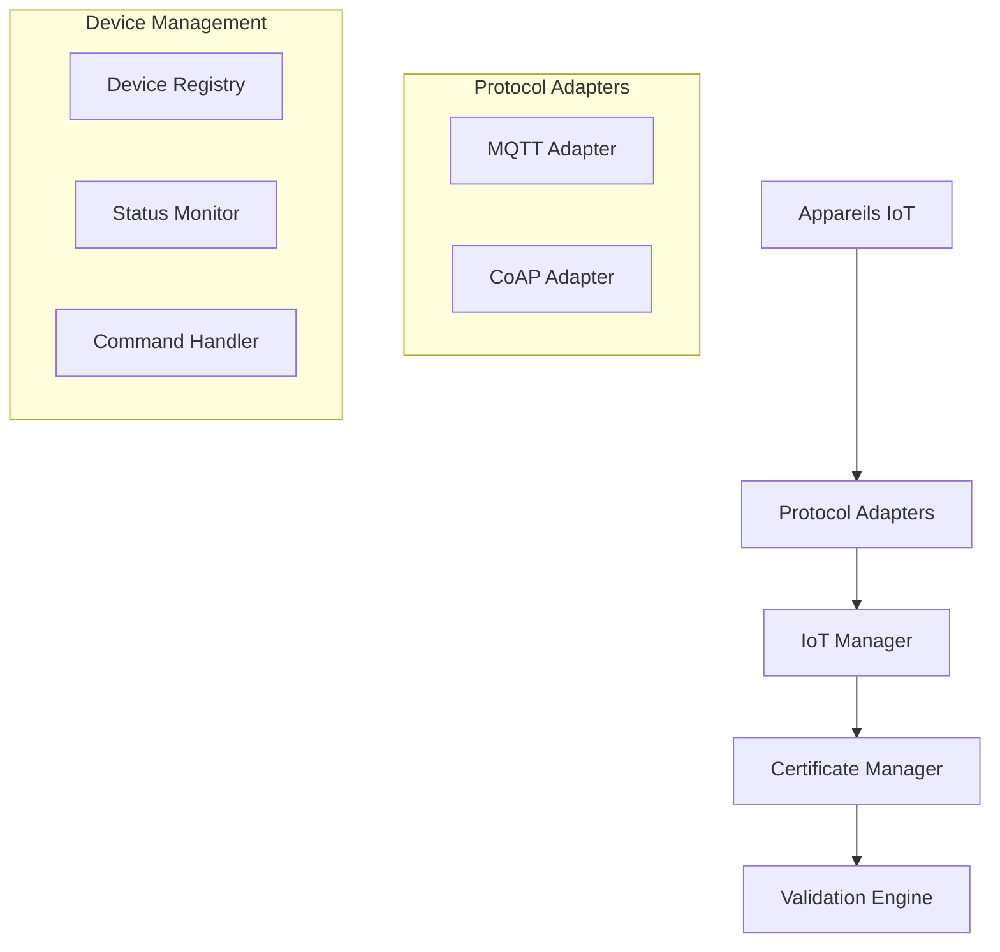

# Support IoT

## Vue d'ensemble
Intégration des appareils IoT pour la gestion et la validation des certificats SSL.

## Fonctionnalités
### Gestion des Appareils
- Découverte automatique
- Configuration à distance
- Mise à jour des certificats
- Surveillance en temps réel
- Gestion d'état avancée

### Protocoles Supportés
- MQTT
  - Pub/Sub messaging
  - QoS configurable
  - Authentification TLS
  - Persistence des messages

- CoAP
  - Communication légère
  - Mode observe
  - Réponses asynchrones
  - Support multicast

## Architecture


## Implementation

### Firmware Template
```cpp
// Exemple d'utilisation du firmware
void setup() {
  // Configuration WiFi & MQTT
  setupWiFi();
  setupMQTT();

  // Chargement du certificat
  loadCertificate();
}

void loop() {
  // Gestion des connexions
  handleConnections();

  // Vérification des certificats
  checkCertificates();

  // Envoi des statuts
  sendStatus();
}
```

### Service Integration
```typescript
// Exemple d'intégration du service IoT
const iot = new IoTManager('mqtt://broker');

// Enregistrer un appareil
await iot.registerDevice({
  id: 'device-001',
  name: 'Sensor 1',
  type: 'sensor'
});

// Mettre à jour un certificat
await iot.updateCertificate('device-001', certificateData);
```

## Sécurité
- Authentification mutuelle TLS
- Chiffrement bout-en-bout
- Rotation automatique des certificats
- Surveillance d'accès
- Protection contre les attaques DoS

## Tests
```bash
# Tests unitaires
npm run test:iot

# Tests d'intégration
npm run test:iot:integration

# Tests de protocoles
npm run test:iot:protocols
```

## Surveillance
- Métriques des appareils
- Statuts de connexion
- Santé des certificats
- Performance réseau
- Utilisation ressources

## Configuration
```env
# Configuration générale
MQTT_BROKER_URL=mqtt://...
COAP_PORT=5683
DEVICE_UPDATE_INTERVAL=3600
MAX_DEVICES=1000

# Sécurité
SSL_CERT_PATH=/path/to/cert
SSL_KEY_PATH=/path/to/key
TLS_VERSION=1.3

# Surveillance
METRICS_INTERVAL=60
HEALTH_CHECK_INTERVAL=300
```