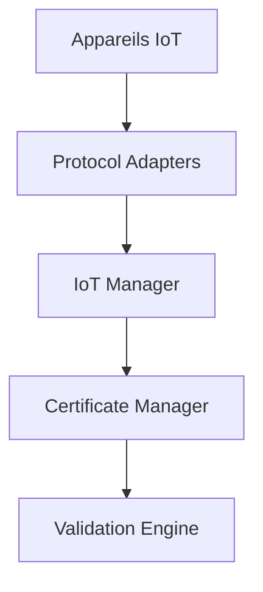

# Support IoT

## Vue d'ensemble
Intégration des appareils IoT pour la gestion et la validation des certificats SSL.

## Fonctionnalités
### Gestion des Appareils
- Découverte automatique
- Configuration à distance
- Mise à jour des certificats
- Surveillance en temps réel

### Protocoles Supportés
- MQTT
- CoAP
- HTTP/HTTPS
- WebSocket

## Architecture


## Utilisation
```typescript
// Exemple d'utilisation
const iot = new IoTManager('mqtt://broker');

// Enregistrer un appareil
await iot.registerDevice({
  id: 'device-001',
  name: 'Sensor 1',
  type: 'sensor',
  // ...
});

// Mettre à jour un certificat
await iot.updateCertificate('device-001', certificateData);
```

## Sécurité
- Authentification mutuelle
- Chiffrement bout-en-bout
- Rotation automatique des certificats
- Surveillance des accès

## Configuration
```env
MQTT_BROKER_URL=mqtt://...
DEVICE_UPDATE_INTERVAL=3600
MAX_DEVICES=1000
```