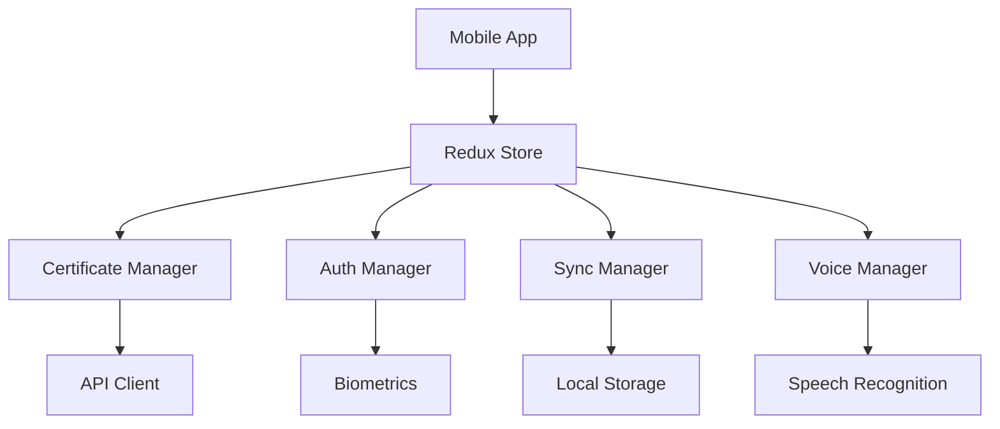

# 📱 Mobile App Documentation

## Features

### Certificate Management
- QR Code scanning
- Real-time validation
- Certificate details view
- Expiration tracking

### Security
- Biometric authentication
- Encrypted storage
- Secure sync
- Access control

### Monitoring
- Push notifications
- Status widgets
- Energy metrics
- Performance analytics

### Voice Commands
- Hands-free operation
- French language support
- Customizable commands
- Voice feedback

Available commands:
- "Vérifier [domaine]" - Lance une vérification SSL
- "Valider [certificat]" - Valide un certificat
- "Scanner" - Active le scanner QR code
- "Statut" - Affiche l'état des certificats
- "Activer/Désactiver notifications" - Gère les notifications

## Development Setup

```bash
# Requirements
node >= 18
react-native-cli
Xcode (for iOS)
Android Studio (for Android)

# Installation
cd mobile
npm install
npm install @react-native-voice/voice @expo/vector-icons

# iOS
npx pod-install
npm run ios

# Android
npm run android
```

## Voice Integration Setup

```bash
# Configuration
# Ajoutez ces permissions dans AndroidManifest.xml
<uses-permission android:name="android.permission.RECORD_AUDIO" />

# Pour iOS, ajoutez dans Info.plist :
<key>NSMicrophoneUsageDescription</key>
<string>We need access to your microphone for voice commands</string>
<key>NSSpeechRecognitionUsageDescription</key>
<string>We need access to speech recognition for voice commands</string>
```

## Architecture



## Testing

```bash
# Run tests
npm test

# Run e2e tests
npm run e2e

# Test voice commands
npm run test:voice
```

## Voice Command Development

Pour ajouter une nouvelle commande vocale :

1. Ajoutez la commande dans `src/services/voice.ts` :
```typescript
const supportedCommands = {
  'ma_nouvelle_commande': /^ma nouvelle commande\s*(.*)$/i,
  // ... autres commandes
};
```

2. Enregistrez le handler dans `src/hooks/useVoice.ts` :
```typescript
voiceService.registerCommand('ma_nouvelle_commande', (args) => {
  handleVoiceCommand('new_command', args);
});
```

3. Mettez à jour l'écran des paramètres dans `screens/VoiceSettings.tsx`