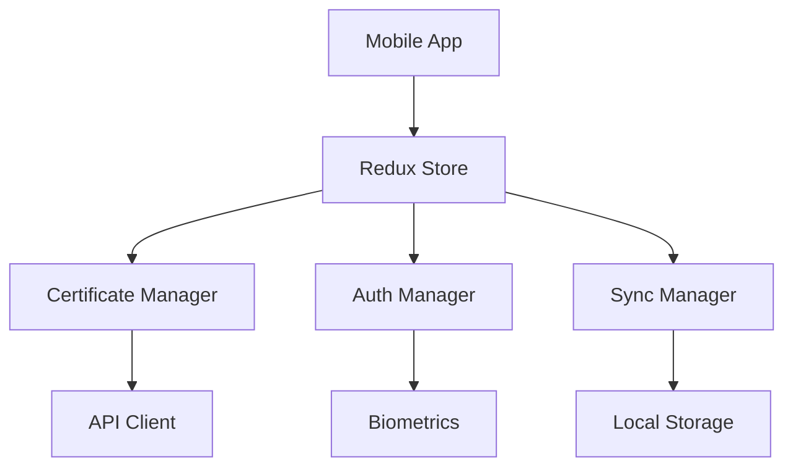

# 📱 Mobile App Documentation

## Features

### Certificate Management
- QR Code scanning
- Real-time validation
- Certificate details view
- Expiration tracking

### Security
- Biometric authentication
- Encrypted storage
- Secure sync
- Access control

### Monitoring
- Push notifications
- Status widgets
- Energy metrics
- Performance analytics

## Development Setup

```bash
# Requirements
node >= 18
react-native-cli
Xcode (for iOS)
Android Studio (for Android)

# Installation
cd mobile
npm install

# iOS
npx pod-install
npm run ios

# Android
npm run android
```

## Architecture



## Testing

```bash
# Run tests
npm test

# Run e2e tests
npm run e2e
```