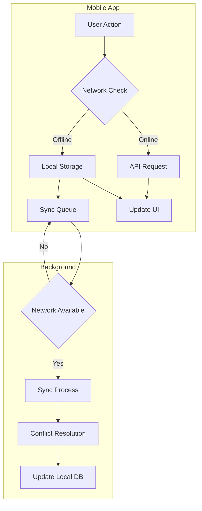
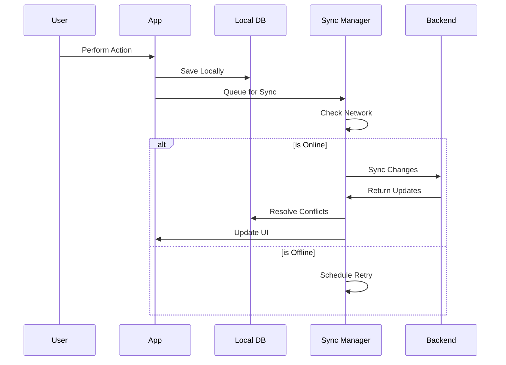
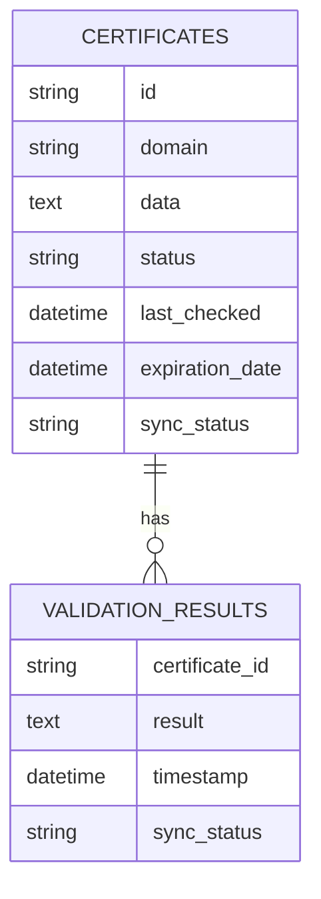

# Offline Mode Architecture

## Flow Overview

## Sync Process

## Data Storage

## Implementation Details

### Storage Layer
- SQLite for structured data
- AsyncStorage for preferences
- Queue system for sync

### Sync Manager
- Background sync with retry
- Conflict resolution
- Network monitoring
- Battery optimization

### Features
1. Automatic Sync
   - Background processing
   - Smart retry logic
   - Battery-aware scheduling

2. Conflict Resolution
   - Last-write-wins strategy
   - Merge resolution
   - Version tracking

3. Network Handling
   - Connection monitoring
   - Automatic retry
   - Queue management