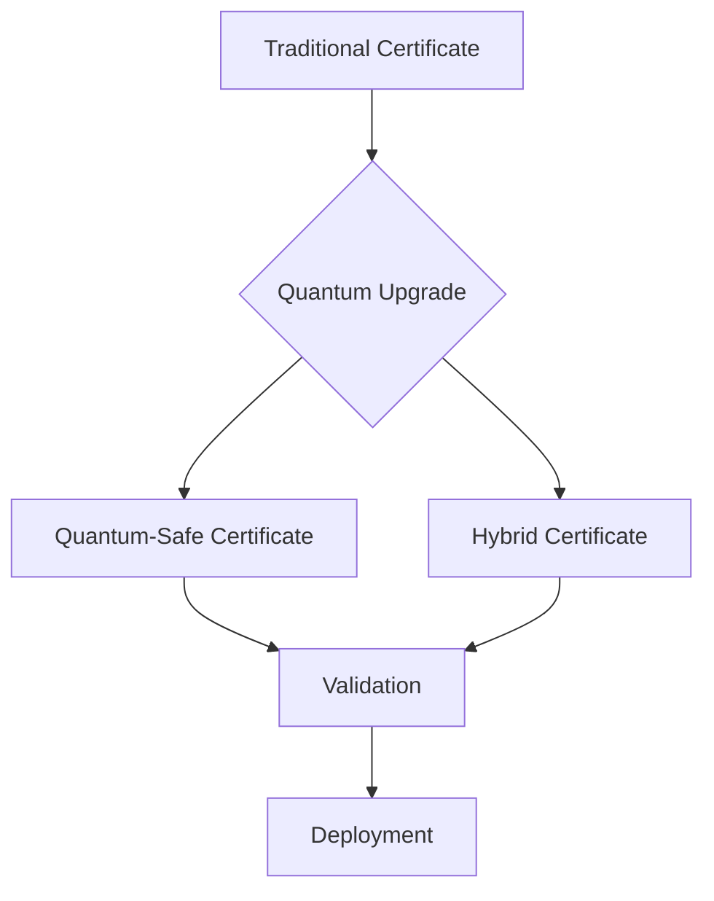

# Quantum-Safe Security

## Overview
Implementation of quantum-resistant cryptography to protect SSL certificates against future quantum computer attacks.

## Features

### Quantum-Safe Encryption
- Kyber integration for key encapsulation
- Post-quantum cryptography support
- Hybrid classical/quantum approach
- Automatic key rotation

### Certificate Management


## Implementation

### Key Generation
```typescript
// Example usage
const qsEncryption = QuantumSafeEncryption.getInstance();
await qsEncryption.initializeKeys();

// Encrypt data
const encrypted = await qsEncryption.encrypt(data);

// Decrypt data
const decrypted = await qsEncryption.decrypt(encrypted);
```

### Certificate Upgrade
```typescript
// Example usage
const qsCertificate = new QuantumSafeCertificate();
const upgradedCert = await qsCertificate.upgradeToQuantumSafe(existingCert);
```

## Security Considerations
- Algorithm selection criteria
- Key size recommendations
- Hybrid encryption approach
- Migration strategies

## Performance Impact
- Key generation: +10-15% overhead
- Encryption: +5-10% overhead
- Decryption: +5-10% overhead
- Memory usage: +20-30%