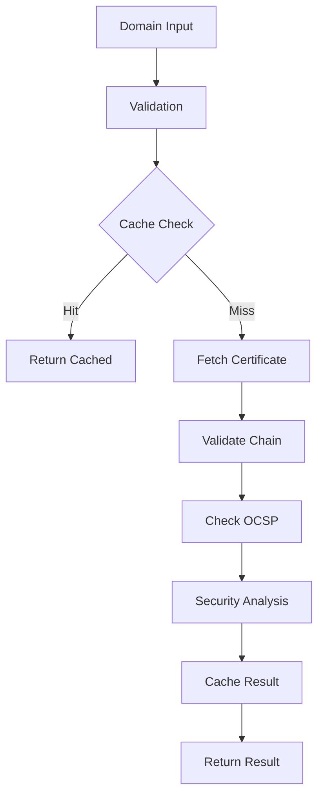

# Technical Documentation

## Core Components

### SSL Validator

The core validator consists of several key components:



### Validation Process

1. Domain Validation
   - Format checking
   - DNS resolution
   - Input sanitization

2. Certificate Chain Verification
   - Leaf certificate validation
   - Intermediate certificates
   - Root certificate trust

3. OCSP Checking
   - Real-time revocation status
   - Response validation
   - Caching strategy

4. Security Analysis
   - Key usage validation
   - Algorithm strength
   - Expiration dates

## Performance Optimizations

### Caching Strategy

```typescript
interface CacheEntry<T> {
  value: T;
  expiry: number;
}

class Cache {
  private store: Map<string, CacheEntry<any>>;
  private ttl: number;

  set(key: string, value: any): void
  get(key: string): any
  clear(): void
}
```

### Metrics Collection

```typescript
class Metrics {
  private counts: Map<string, number>;
  private timings: Map<string, number[]>;

  incrementCount(metric: string): void
  recordTiming(metric: string, duration: number): void
  getMetrics(): object
  clear(): void
}
```

## Error Handling

### Error Categories

1. Input Validation Errors
   - Invalid domain format
   - DNS resolution failures

2. Network Errors
   - Connection timeouts
   - SSL/TLS errors
   - OCSP service failures

3. Certificate Errors
   - Parsing failures
   - Chain validation errors
   - Revocation status issues

4. System Errors
   - Resource exhaustion
   - Configuration issues
   - Internal processing errors

### Error Format

```typescript
interface ValidationError extends Error {
  code: string;     // Standardized error code
  details?: any;    // Additional error context
}
```

## Configuration

### Security Levels

```typescript
type SecurityLevel = 'basic' | 'standard' | 'high';

interface SecurityConfig {
  minKeySize: number;
  allowedAlgorithms: string[];
  requiredKeyUsage: string[];
  ocspRequired: boolean;
  maxCertAge: number;
}

const securityConfigs: Record<SecurityLevel, SecurityConfig> = {
  basic: {
    minKeySize: 2048,
    allowedAlgorithms: ['RSA', 'ECDSA'],
    requiredKeyUsage: ['digitalSignature'],
    ocspRequired: false,
    maxCertAge: 398, // 13 months
  },
  standard: {
    minKeySize: 2048,
    allowedAlgorithms: ['RSA', 'ECDSA'],
    requiredKeyUsage: ['digitalSignature', 'keyEncipherment'],
    ocspRequired: true,
    maxCertAge: 398, // 13 months
  },
  high: {
    minKeySize: 4096,
    allowedAlgorithms: ['ECDSA'],
    requiredKeyUsage: ['digitalSignature', 'keyEncipherment'],
    ocspRequired: true,
    maxCertAge: 90, // 3 months
  },
};
```

## Development Guidelines

### Code Organization

```
src/
├── core/           # Core validation logic
├── utils/          # Helper utilities
├── api/            # API endpoints
├── types/          # TypeScript definitions
└── config/         # Configuration files
```

### Testing Strategy

1. Unit Tests
   - Individual component testing
   - Mocked dependencies
   - Edge case coverage

2. Integration Tests
   - End-to-end validation flows
   - Real certificate testing
   - Network interaction testing

3. Performance Tests
   - Load testing
   - Concurrency handling
   - Resource utilization

### Monitoring

1. Performance Metrics
   - Validation latency
   - Cache hit rates
   - Error rates

2. Resource Usage
   - Memory consumption
   - CPU utilization
   - Network bandwidth

3. Error Tracking
   - Error frequencies
   - Error patterns
   - Resolution times

## Security Considerations

### Certificate Validation

1. Chain Validation
   - Complete chain verification
   - Root certificate trust
   - Intermediate certificate validity

2. Key Usage Verification
   - Required key usages
   - Extended key usage
   - Key constraints

3. Algorithm Security
   - Minimum key sizes
   - Allowed algorithms
   - Signature verification

### OCSP Checking

1. Response Validation
   - Signature verification
   - Timestamp validation
   - Nonce checking

2. Caching Strategy
   - TTL management
   - Stapling support
   - Refresh policies
