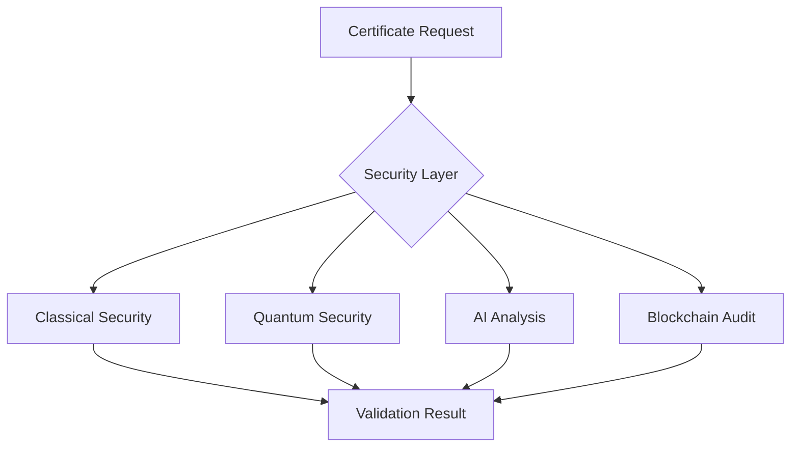
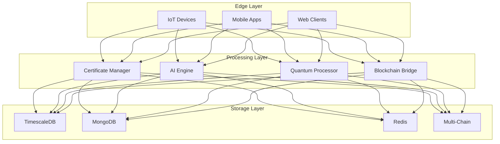

# Technical Documentation

## Core Components

### Certificate Validator
- OpenSSL integration
- Real-time validation
- Multi-protocol support

### Voice Recognition System
- Streaming recognition using @react-native-voice/voice
- Command pattern matching with RegExp
- Event-based state management
- Multi-language support (FR)

### Blockchain Audit System
- Smart contract based auditing
- Immutable record keeping
- Cross-chain integration
- Multi-signature validation

### AI Systems
- TensorFlow.js integration
- Real-time threat detection
- Automated management
- Certificate lifecycle automation
- Predictive security analysis

### Quantum-Safe Security
- Kyber post-quantum cryptography
- Hybrid classical/quantum encryption
- Quantum-resistant certificates
- Auto-upgrade mechanisms

### IoT Support
- Multi-protocol adapters (MQTT, CoAP)
- Device management
- Secure certificate deployment
- Real-time monitoring

### Cross-Chain Bridge
- Multi-chain support
- Atomic transfers
- Validator consensus
- Certificate synchronization

### Database Layer
- TimescaleDB for metrics
- MongoDB for analytics
- Redis for caching
- Blockchain storage

## Security Architecture

## Performance Optimization
- Lazy loading
- Memory management
- Cache strategies
- Cross-chain batching
- Quantum hybrid processing

## Error Handling
- Graceful degradation
- Automatic retry
- Cross-chain fallback
- Multi-chain consistency
- Quantum state preservation

## Integration Points

### Security Providers
- Classical PKI
- Quantum-safe algorithms
- Blockchain networks
- AI services

### External Systems
- Certificate authorities
- Blockchain validators
- AI training pipelines
- IoT device networks

## Deployment Architecture

