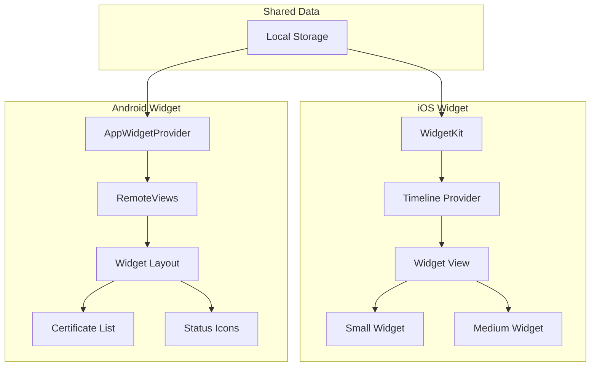
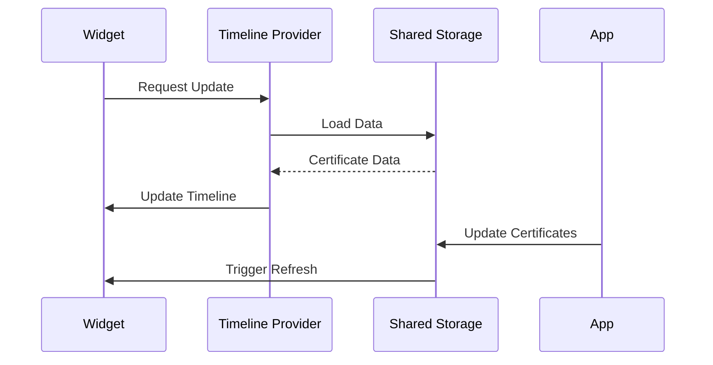
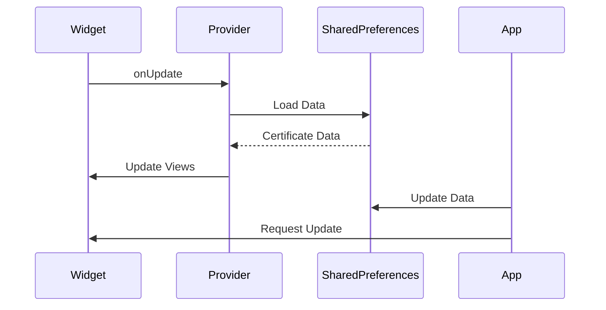

# Native Widgets Implementation

## Overview



## iOS Implementation



## Android Implementation



## Features

### iOS Widget
- Small and medium sizes
- Dynamic updates
- Interactive elements
- Dark/Light mode support

### Android Widget
- Responsive layout
- Custom backgrounds
- Touch interactions
- Auto-refresh

## Configuration

### iOS Setup
```swift
// Register widget extension
let kind: String = "SSLWidget"
let configuration = StaticConfiguration(kind: kind, provider: Provider())
```

### Android Setup
```xml
<!-- Widget info in AndroidManifest.xml -->
<receiver android:name=".SSLWidget">
    <intent-filter>
        <action android:name="android.appwidget.action.APPWIDGET_UPDATE" />
    </intent-filter>
    <meta-data
        android:name="android.appwidget.provider"
        android:resource="@xml/ssl_widget_info" />
</receiver>
```

## Data Flow

1. App updates certificate data
2. Data stored in shared storage
3. Widgets observe changes
4. UI updates automatically

## Best Practices

- Minimize memory usage
- Optimize refresh rates
- Handle errors gracefully
- Support all device sizes