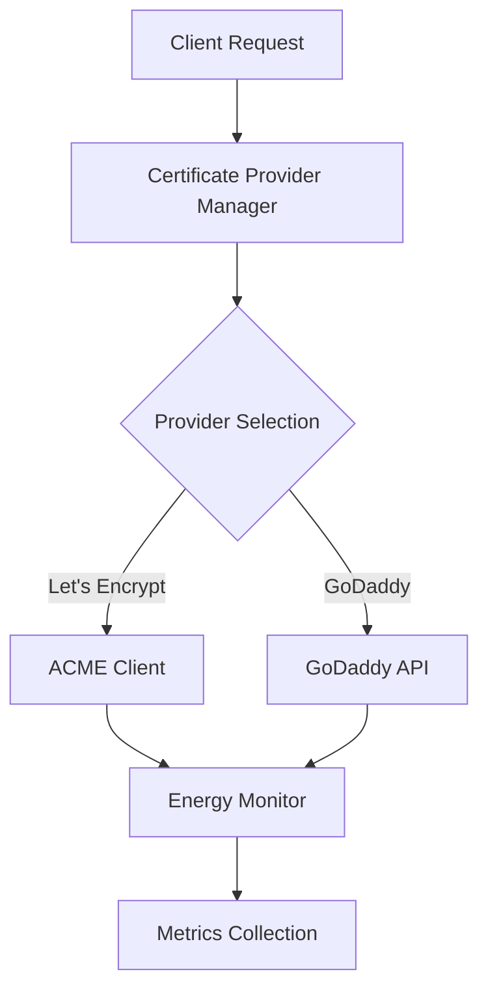
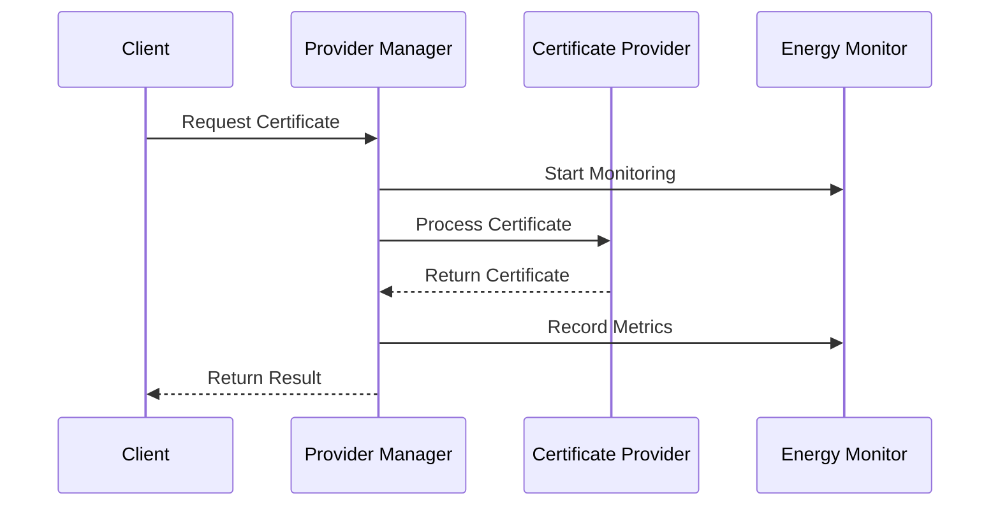

# Architecture du Système

## Vue d'ensemble

```mermaid
graph TD
    A[Client Request] --> B[Certificate Provider Manager]
    B --> C{Provider Selection}
    C -->|Let's Encrypt| D[ACME Client]
    C -->|GoDaddy| E[GoDaddy API]
    D & E --> F[Energy Monitor]
    F --> G[Metrics Collection]
```

## Processus de Validation

```mermaid
sequenceDiagram
    participant C as Client
    participant M as Provider Manager
    participant P as Certificate Provider
    participant E as Energy Monitor

    C->>M: Request Certificate
    M->>E: Start Monitoring
    M->>P: Process Certificate
    P-->>M: Return Certificate
    M->>E: Record Metrics
    M-->>C: Return Result
```
