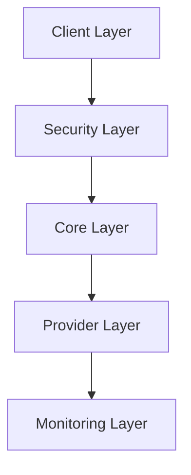

# 🏗️ Architecture

## Vue d'ensemble

```mermaid
graph TD
    A[Client Layer] --> B[Security Layer]
    B --> C[Core Layer]
    C --> D[Provider Layer]
    D --> E[Monitoring Layer]
```

## Composants

Chaque couche est conçue pour être :
- Indépendante
- Testable
- Sécurisée
- Évolutive